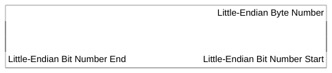
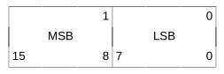
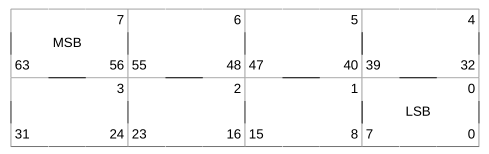
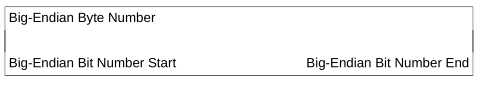
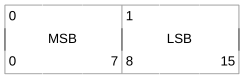
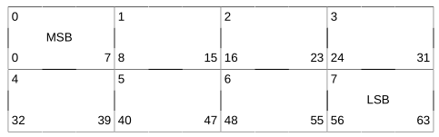
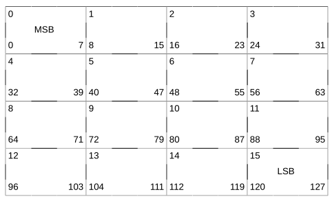

# Byte ordering

The standard recognizes the following data formats:

* 8-bit byte
* 16-bit halfword
* 32-bit word
* 64-bit doubleword
* 128-bit quadword

Byte ordering defines how the bytes that make up halfwords, words, doublewords, and quad-words are ordered in memory. Most significant byte (MSB) byte ordering, or big endian as it is sometimes called, means that the most significant byte is located in the lowest addressed byte position in a storage unit (byte 0). The nanoMIPS processor supports either big endian or little endian byte ordering.

The figures below illustrate the conventions for bit and byte numbering within various width storage units. These conventions hold for both integer data and floating-point data, where the most significant byte of a floating-point value holds the sign and at least the start of the exponent.

**Little-endian bit and byte numbering**

**Little-endian bit and byte numbering in half-words**

**Little-endian bit and byte numbering in words**

**Little-endian bit and byte numbering in quadwords**

**Big-endian bit and byte numbering**

**Big-endian bit and byte numbering in half-words**

**Big-endian bit and byte numbering in words**

**Big-endian bit and byte numbering in doublewords**

**Big-endian bit and byte numbering in quadwords**

