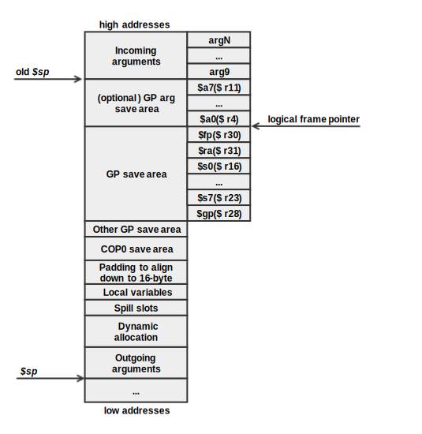

# Stack Frame Organization

The following diagram shows how the stack frame should be layed out.

The following requirements apply to the stack frame:

* The stack pointer shall maintain the quadword (16-byte) alignment.
* The stack pointer shall be decremented in the function prologue and restored prior to return.
* Frame chain consisting of the frame pointer and return address, if required, to be saved below the logical frame pointer. 
* The frame pointer, if required, must be biased by 4096 bytes downward from the top of the logical frame. 
* Allocate space for:
    * `GP` argument save area. Used only for variadic functions. Space for argument registers for anonymous arguments shall be allocated by the caller. Space must be padded to the alignment requirements.
    * Saved temporary registers area. Space for `$fp`, `$ra`, `$s0-$s7`, `$gp` registers, respectively. These must be saved before changing their contents and restored at the exit.
    * Allocate space for caller saved registers in an interrupt handler. Used only in interrupt handler routines. 
    * `COP0` save area. Space to preserve `STATUS` and `EPC` registers.
    * The save area must be quadword (16-byte) aligned.
    * Local variables and temporaries.
    * Outgoing arguments if passed arguments to a function do not fit into the argument registers.
 
Most of the time, the order of registers being saved and restored will not matter for the user. However, the order is mandatory for assembly programmers, especially, when accessing a required slot or when mixing `SAVE` or `RESTORE` instructions with manually saved/restored registers. Note that the order of saved/restored registers is also used by the `SAVE`/`RESTORE` instructions. Refer to the nanoMIPS ISA for further details.
